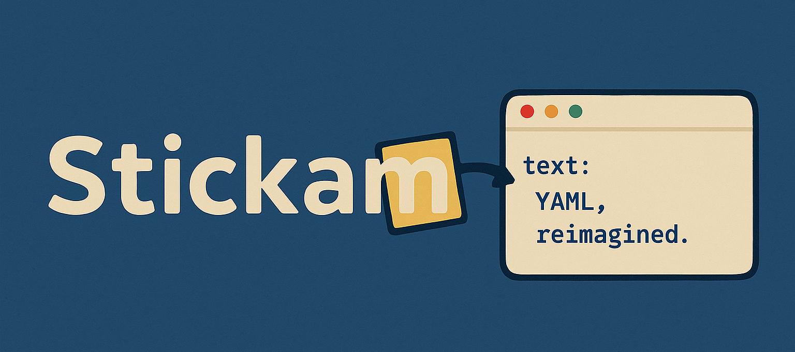
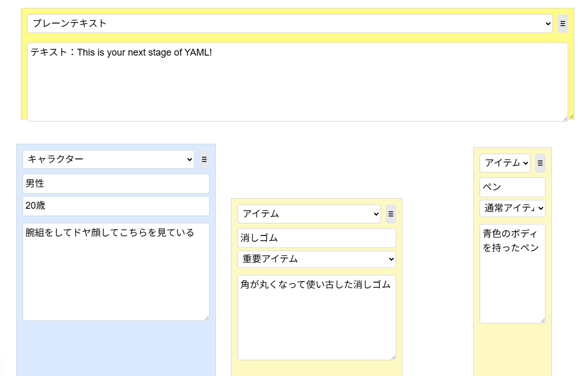

# Stickaml

[](https://nextjs.org/)
[](https://reactjs.org/)
[](https://tailwindcss.com/)
[](https://opensource.org/licenses/MIT)
[](https://github.com/Maji3429/Stickaml)
[](https://github.com/Maji3429/Stickaml)

ドラッグ可能な付箋を使って、視覚的に画像生成用のYAMLプロンプトを生成するNext.jsアプリケーションです。

例：
<div style="display: flex; align-items: center;">
  
  <span style="font-size: 24px; font-weight: bold;">→</span>
  
</div>

## 概要

このアプリケーションは、テキストベースのYAML作成を視覚的に行えるようにするためのツールです。ユーザーは直感的なインターフェースを通じて、ドラッグ可能な付箋をキャンバスに配置し、それらの組み合わせからYAMLプロンプトを自動生成できます。YAMLプロンプトをgpt-4o-image-generationに渡すことが主な用途です。

### 主な機能

- 複数タイプの付箋をドラッグ＆ドロップで配置
- リサイズ可能な付箋
- カスタマイズ可能なキャンバスサイズとアスペクト比
- キャンバス全体に適用されるプロンプト要素の管理
- リアルタイムYAMLプレビュー

## 技術スタック

- [Next.js 15](https://nextjs.org/) - Reactフレームワーク
- [React 19](https://react.dev/) - UIライブラリ
- [TailwindCSS 4](https://tailwindcss.com/) - スタイリング
- [React Resizable](https://github.com/react-grid-layout/react-resizable) - リサイズ機能

## 始め方

1. リポジトリをクローンします：

```bash
git clone https://github.com/Maji3429/Stickaml.git
cd Stickaml
```

2. 依存関係をインストールします：

```bash
npm install
# または
yarn
# または
pnpm install
# または
bun install
```

3. 開発サーバーを起動します：

```bash
npm run dev
# または
yarn dev
# または
pnpm dev
# または
bun dev
```

4. ブラウザで [http://localhost:3000](http://localhost:3000) を開きます。

## 使い方

1. ツールバーから「付箋追加」ボタンをクリックして新しい付箋を追加します
2. 付箋をドラッグしてキャンバス上の任意の位置に配置します
3. 付箋の隅をドラッグしてサイズを変更します
4. キャンバス全体の設定セクションでプロンプト要素を追加します
5. 付箋の中のテキスト入力欄でプロンプトを調整します
6. 右側のパネルでリアルタイムに生成されるYAMLを確認します

## カスタマイズ

キャンバスのアスペクト比は以下のプリセットから選択できます：
- 16:9（デフォルト）
- 4:3
- 1:1
- カスタム（幅と高さを指定）

## コントリビューション

プルリクエストは大歓迎です。大きな変更を行う場合は、まずissueを作成して変更内容を議論しましょう。(これを作成した人はあまりOSSに慣れていないので変なことしてしまうかもしれません。あらかじめご了承ください。)

## ライセンス

[MIT](https://choosealicense.com/licenses/mit/)

## 開発者

作成者: [Maji3429]

---

このプロジェクトは [create-next-app](https://nextjs.org/docs/app/api-reference/cli/create-next-app) でブートストラップされました。
